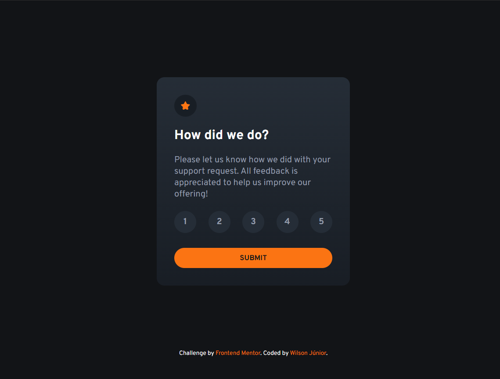

# Frontend Mentor - Interactive Rating Component Solution

This is a solution to the [Interactive Rating Component challenge on Frontend Mentor](https://www.frontendmentor.io/challenges/interactive-rating-component-koxpeBUmI). This project demonstrates a functional rating component that allows users to select a rating, submit it, and view a thank-you message.

## Table of Contents

- [Overview](#overview)
  - [The Challenge](#the-challenge)
  - [Screenshot](#screenshot)
  - [Links](#links)
- [My Process](#my-process)
  - [Built With](#built-with)
  - [What I Learned](#what-i-learned)
  - [Continued Development](#continued-development)
  - [Useful Resources](#useful-resources)
- [Author](#author)
- [Acknowledgments](#acknowledgments)

## Overview

### The Challenge

Users should be able to:

- View the optimal layout for the app depending on their device's screen size
- See hover states for all interactive elements on the page
- Select and submit a number rating
- See the "Thank you" card state after submitting a rating
- Display an error message if no rating is selected when submitting

### Screenshot



### Links

- Solution URL: [GitHub Repository](https://github.com/your-username/interactive-rating-component)
- Live Site URL: [Live Demo](https://your-live-site-url.com)

## My Process

### Built With

- Semantic HTML5 markup
- CSS custom properties
- Flexbox
- JavaScript

### What I Learned

During this project, I learned how to handle user interactions effectively and how to update the UI based on those interactions. Here are a few highlights:

- **Dynamic UI Updates:** I learned to use `innerHTML` to dynamically update the content of the page and to handle the visibility of elements based on user actions.

  ```js
  const displayThankYouMessage = (rating) => {
    section.innerHTML = `
      <div class="thank-you">
        
        <p id="selected">You selected ${rating} out of 5</p>
        <h1>Thank you!</h1>
        <p>We appreciate you taking the time to give a rating. If you ever need more support, don't hesitate to get in touch!</p>
      </div>
    `;
  };
  ```

- **Handling Edge Cases:** Implemented error handling to ensure that the user is prompted if they try to submit without selecting a rating.

```js
if (!selectedRating) {
  alert("Please select a rating before submitting.");
  return;
}
```

### Continued Development

**In future projects, I aim to:**
Improve accessibility features and ensure that the component is usable by all users, including those with disabilities.
Refine the responsiveness of the component to ensure optimal display on all screen sizes.
Explore more advanced JavaScript techniques to handle complex user interactions and state management.

### Useful Resources

    MDN Web Docs - innerHTML - For understanding how to dynamically update HTML content.
    JavaScript.info - Event Delegation - Helpful for managing events efficiently.

### Author

GitHub: [@WilsonJunior](https://github.com/willsf2021)
Frontend Mentor - [@wilsonjunior](https://www.frontendmentor.io/profile/willsf2021)

### Acknowledgments

    A big thank you to the Frontend Mentor community for providing this challenge and to all the developers and resources that helped in    understanding and implementing the solution.
